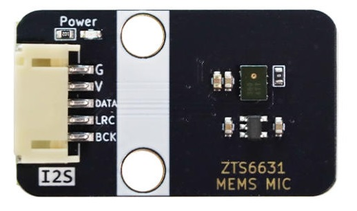
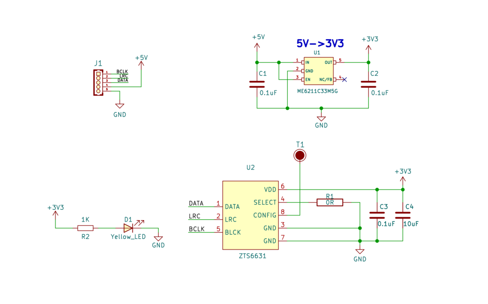
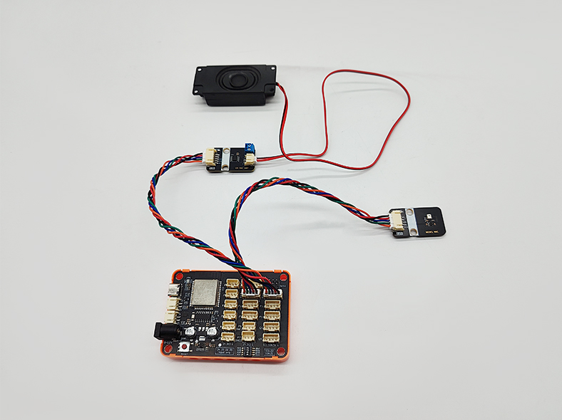

# i2s-mems-digital-microphone-module

Physical drawing
-----------------------------------------------------------------------------------------------------------------------------------------------------------

Overview
------------------------------------------------------------------------------------------------------------------------------------------

The I2S MEMS digital microphone module is based on a ZTS6631 sound sensor with a sound-sensitive condenser electret microphone built in. The sound waves cause the electret film in the microphone to vibrate, causing a change in capacitance, resulting in a small voltage that changes accordingly. This voltage is then converted to a voltage of 0-3.3V, which is received by the data collector through A/D conversion via the I2S protocol and master control communication. This module not only features a compact size, but also offers high sensitivity and low noise characteristics, making it ideal for various applications requiring high-quality audio input. Combined with the powerful processing power of ESP32 and other main control devices, users can easily implement functions such as speech recognition, recording, and AI learning.
Schematic

----------------------------------------------------------------------------------------------------------------------------------------------------

[The schematic can be viewed here](./ZTS663_I2S_MEMS_MIC_SCH.pdf)
Chip Specifications

--------------------------------------------------------------------------------------------------------------------------------------------------------------------------------

[Click here to view the I2S microphone datasheet](./ZTS6631_datasheet.pdf)
Module parameters

---------------------------------------------------------------------------------------------------------------------------------------------------------------------

* Working voltage: module is 3.3~5V, chip working voltage (1.6V-3.6V)
* Microphone packaging process: MEMS
* Directionality: omnidirectional top inlet
* Data interface: I2S
* Sensitivity: -26dBFS
* Signal-to-noise ratio: 64dB
* Output sampling rate: 4kHZ~96kHZ
* Effective data bit width: 24 bits
* Dimensions: 38.4x22.4mm   Weight: 3.6g

Arduino ESP32 usage example
---------------------------------------------------------------------------------------------------------------------------------------------------------------------------------------------

Testing the microphone requires the use of an I2S audio amplifier in conjunction with it to complete the experiment.

[Click here for instructions on how to use the I2S audio amplifier module](https://github.com/nulllaborg/i2s-audio-amplifier-module)

### Lab Sheet

| Name                               | Quantity |
|:----------------------------------:|:--------:|
| ESP32-IOT-BOARD                    | 1        |
| I2S audio amplifier module         | 1        |
| I2S mems digital microphone module | 1        |
| PH2.0 interface speaker module     | 1        |
| 5-Pin PH2.0 to PH2.0 Cable         | 2        |
| TypeC cable                        | 1        |

### The wiring is as follows

| I2S mems digital microphone module | ESP32 PIN |
|:----------------------------------:|:---------:|
| SD                                 | 27        |
| WS                                 | 26        |
| SCK                                | 25        |

| I2S audio amplifier module | ESP32 PIN |
|:--------------------------:|:---------:|
| BCLK                       | 33        |
| LRCLK                      | 32        |
| DIN                        | 23        |

[Arduino sample code for the ESP32](https://github.com/nulllaborg/i2s-mems-digital-microphone-module/examples)

After downloading, open [**esp32_i2s_mic_test.ino**](https://github.com/nulllaborg/i2s-mems-digital-microphone-module/examples/esp32_i2s_mic_test/esp32_i2s_mic_test.ino) the file with Arduino IDE, select ESP32 on the motherboard, and upload it through Arduino IDE.

 Test phenomena:

1. After the upload is successful, you will first hear the speaker playing "易创空间", and the front speaker is working normally.

2. Speak to the microphone, and you can hear the sound recorded by the microphone in real time on the speaker module.
